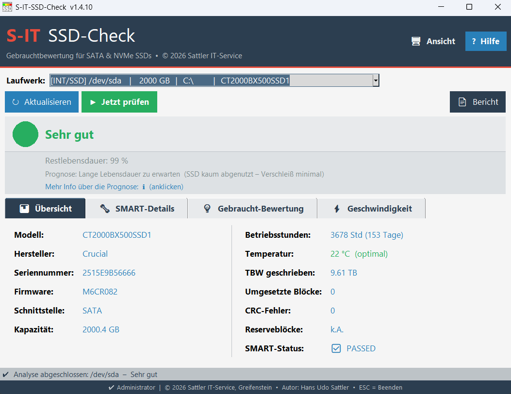
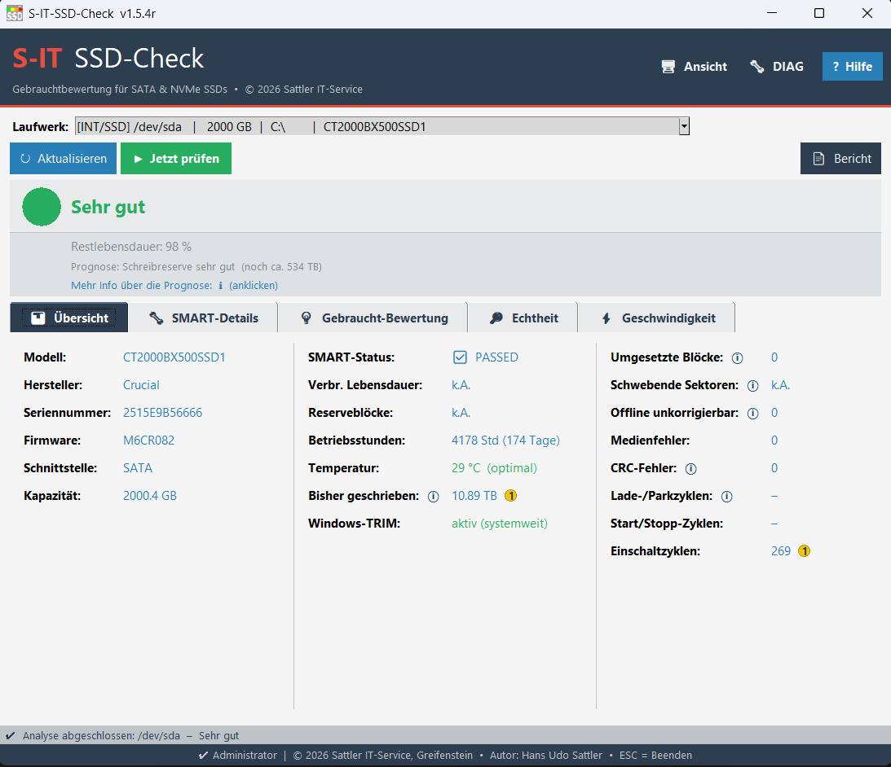
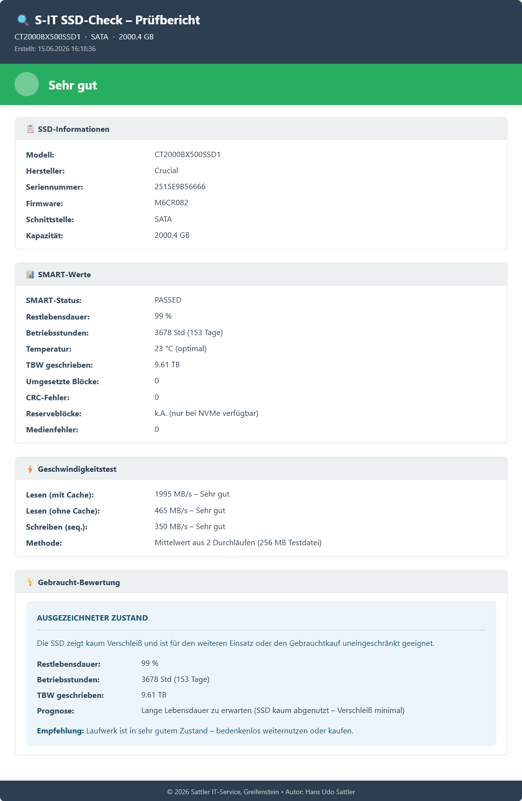

# S-IT SSD-Check

SSD health and SMART analysis tool for Windows.

Portable Windows utility for checking SSD condition, remaining lifetime, SMART values and used SSDs before buying.

## Features

- SSD and NVMe SMART analysis
- SATA, USB and NVMe support
- Health traffic light system
- SMART details and warnings
- HTML customer report export
- Automatic manufacturer detection
- Portable – no installation required
- Windows 10 / 11 compatible

## Screenshots

### Drive overview

### SSD analysis result

### HTML customer report

## Download

Download latest release here:

https://github.com/SattlerIT/sit-ssd-check/releases/latest

## Third Party Components

This software contains `smartctl.exe` from the smartmontools project.

- smartmontools: https://www.smartmontools.org
- License: GNU GPL v2

See:
`smartmontools-LICENSE.txt`

## License

Freeware © 2026 Sattler IT-Service  
Author: Hans Udo Sattler
