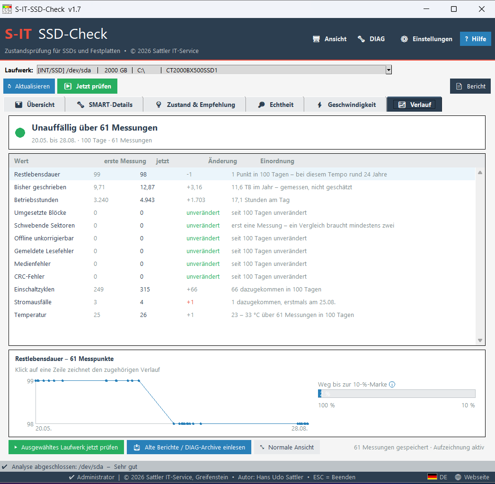
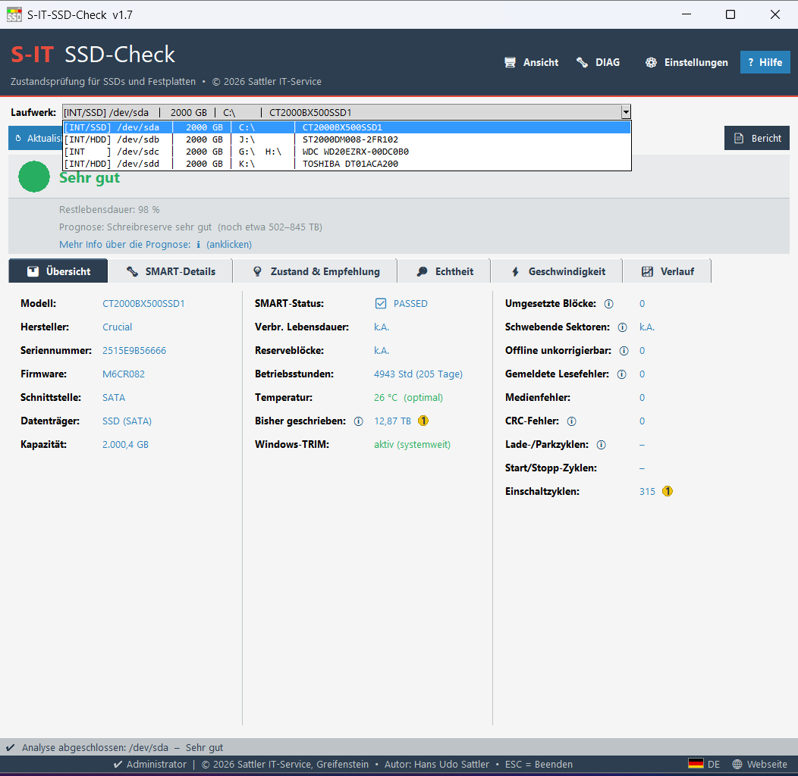
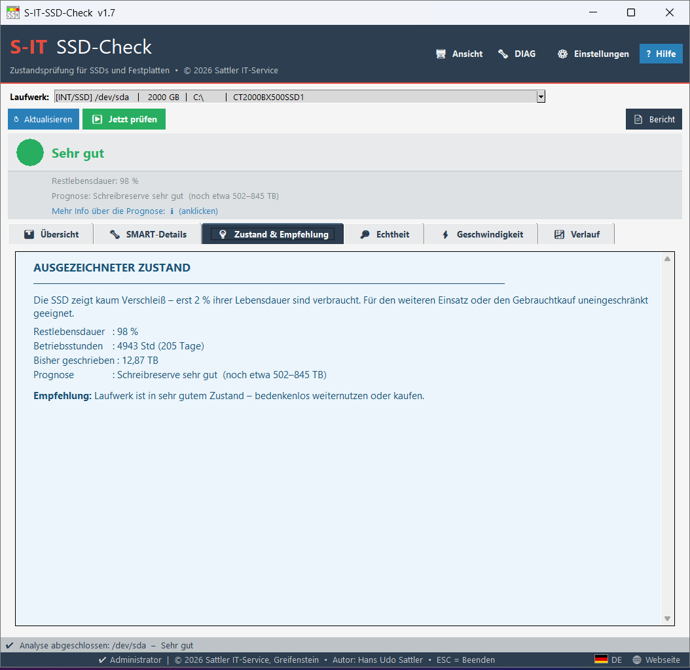
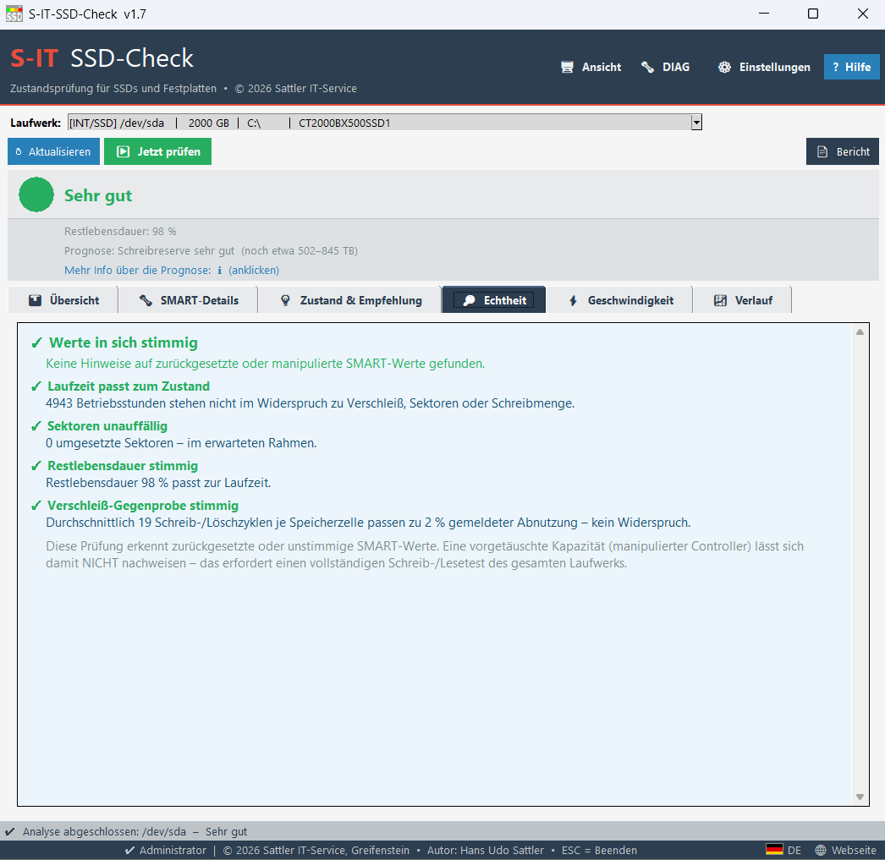
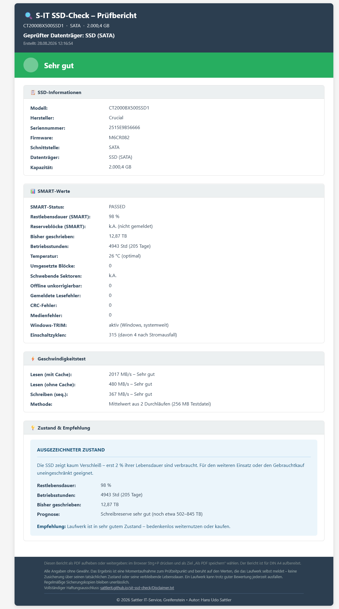

# S-IT SSD-Check

Health check for SSDs and hard disks — in plain language.

Most tools show you the raw SMART values and leave the interpretation to
you. This one reads them and gives a verdict: from "Very good" to
"DEFECTIVE – REPLACE IMMEDIATELY!", together with the reasoning behind it
and a recommendation. For your own PC or laptop, or before buying a
second-hand drive.

## Features

- Traffic-light verdict in plain words, with the reasoning shown
- **Red only with proof** — a low wear value alone is not enough. A drive
  can report 100 % remaining life and still be defective, and the tool
  says so
- **Measurement history** — records the key figures at every check, so you
  see what has changed and what has not. Earlier reports can be imported
- Authenticity check: detects reset counters and contradictory values
- Speed test with an assessment that takes the drive type into account
- Printable HTML report, ready for A4 and PDF export
- Implausible values are discarded and marked, with the reason, instead of
  being passed on as a figure
- SATA, NVMe and USB; SSDs and conventional hard disks
- Available in English, German and Dutch
- Portable — runs without installation, also from a USB stick
- Windows 10 / 11

## Screenshots

### Drive overview

### Condition & advice

### Authenticity check

### HTML report

## How the rating works

Five principles decide what the tool says. They are disclosed in the help
file so that every verdict can be understood — and questioned:

1. **Wear and defect are two different things.** The remaining life says
   nothing about whether a drive is losing sectors right now.
2. **Red only with proof.** Reallocated, pending or uncorrectable sectors,
   reported read errors, a failed self-test — a low wear value alone is
   not enough. A false alarm costs a working drive.
3. **Implausible values are discarded, not asserted.** An honest gap is
   better than a confident wrong number.
4. **SSDs and hard disks are rated differently.** Hard disks have no flash
   wear; what is rated is the actual error state.
5. **Gaps in the data are disclosed**, including why.

## Download

https://github.com/SattlerIT/sit-ssd-check/releases/latest

Project page: https://sattlerit.github.io/sit-ssd-check/

## Third Party Components

This software includes the following open-source programs, redistributed
unchanged:

**smartctl.exe** – from the smartmontools project, used to read the
drives' SMART data.
- smartmontools: https://www.smartmontools.org
- License: GNU GPL v2

**7z.exe** – parts of the 7-Zip program by Igor Pavlov, used to create the
encrypted diagnostic files (DIAG menu).
- 7-Zip: https://www.7-zip.org
- License: GNU LGPL

Full license texts are provided in the `3rd-Party-Licenses` folder.

## License

Freeware © 2026 Sattler IT-Service  
Author: Hans Udo Sattler
